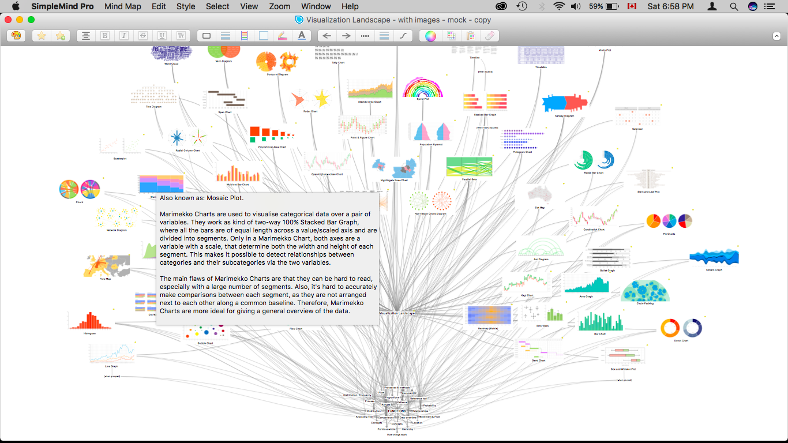
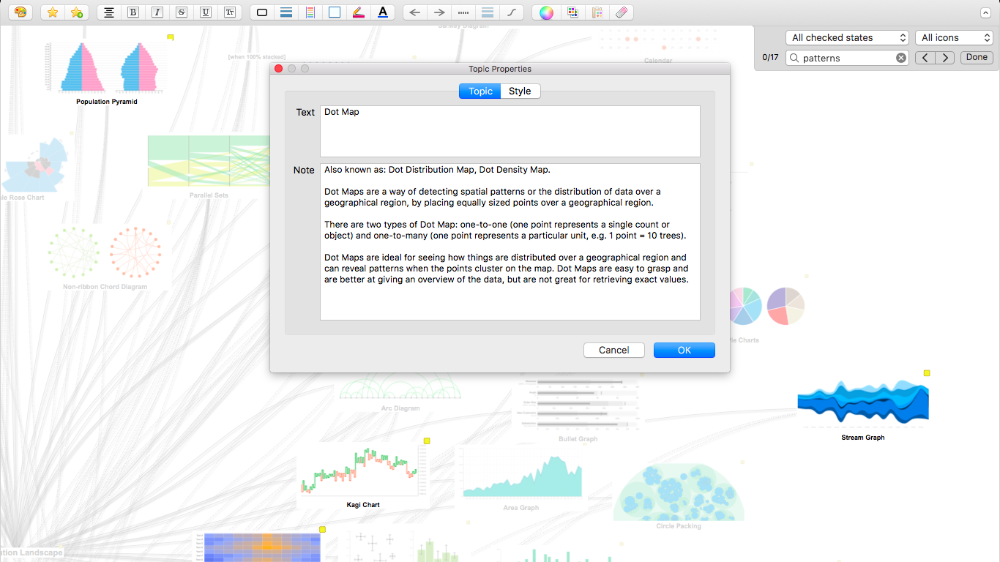
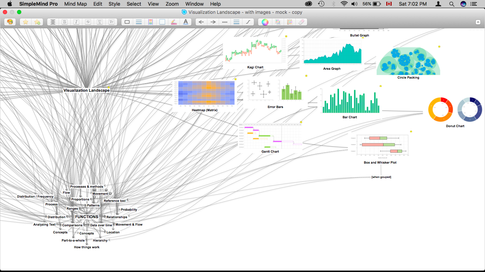
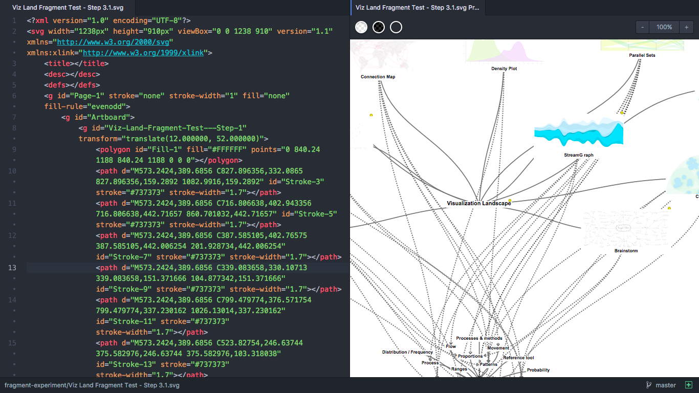
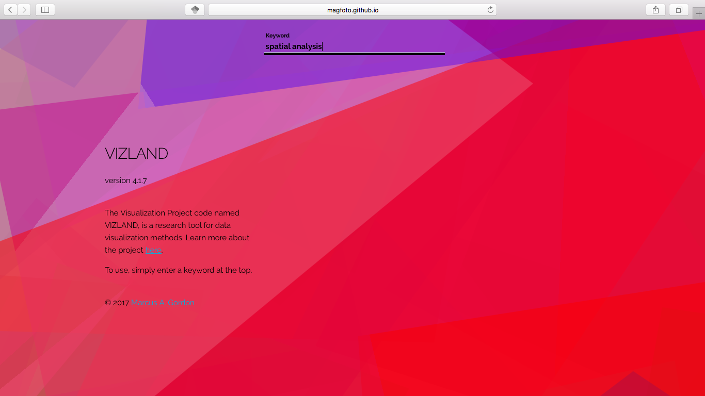

#    VIZLAND
Version 4.1.7



The Visualization Project allows the exploration of 60 common data visualization types, their descriptions, and examples of use.  The project is a web prototype that is to act as a learning tool and satisfy the need to query visualization types, more specifically, their functions, interactively.

This file documents the development and experimentation process behind the prototype.  To be a learning tool in the OCAD University Visual Analytics Lab, it will experience further experimentation by graduate students and researchers in our quest for knowledge and analysis of data visualization methods.

The original information source used here was manually transcribed from the Data Visualisation Catalogue by Severino Ribecca. [About](http://www.datavizcatalogue.com/about.html)

###   Process
The process involved in creating VIZLAND began with a mind map, then a PDF document, an SVG image and finally an HTML document.  The transition between these states are at the core of the prototyping research. In context to the subject matter of urban informatics systems, VIZLAND is purposed to provide a data visualization query element of a decision support system.  This outcome is geared to be a web based tool, and open for research use.

---
#### High Level Stages of Prototype research
---

Process: Stage A. Mind Map Dataset

Process: Stage B. Converting PDF to SVG

Process: Stage C. The Vanilla Manifesto

Process: Stage D. The 'BUILD' Environment

---

#  Version History

##    __Version 1__

The first concept was a mind map created using Simplemind software. The purpose was to begin a preliminary map of the 60 viz types and make manual connections between them and their functions.

###   The First Experiment

The first experiment focused on making the mind map capable of searching function keywords such as _patterns_, _distribution_, _spatial_, _historical_, etc.  Enter the mind map software Simplemind.  Others could have been used, but this one was chosen based on reasons such as design control, export formats, and customizing branch logic.



The mind map consists of two central root nodes, one for the data visualization types, the other for the functions.



The version 1 of VIZLAND is simply about the creation of a dataset, that wasn't your traditional spreadsheet, plain text, or database file.  Instead, I opted for a mind map acting as a database explored visually, and using the softwares' _FIND_ feature to query the dataset. Also, the map is exported in high-definition PDF to prepare it to move from Stage A to Stage B: a conversion to SVG.

---

##    __Version 2__

This step in creating version 2 of VIZLAND was to begin making it _code-ready_.  This simply meant converting the vector PDF format to SVG format.  Converting it this way makes the map accessible with the document object model (DOM).

###   Road to SVG

Many ways were researched for the conversion of PDF to SVG.  From prior experience, preferred methods included using Adobe Illustrator, Adobe Photoshop, and ImageMagick.  Other tools included SVGSUS, Inkscape, Affinity Designer, Freemind (another mind map software), and many others.  But the importance of Stage C comes into play here in making this version.  The idea behind the Vanilla Manifesto is the encouragement of clean and concise code, preferably native code, minimal use of resources, or any combination of these listed options.  In the case of this research, the manifesto refers primarily to the minimalist approach to the entire prototyping lifecycle.  This actually began in version 1 by choosing a minimalist mind mapping software, choosing to opt for the use of Markdown for writing (such as these notes), the PDF and SVG file formats used as the basis from information design to code, and utilizing the OPML file format as method to store the structure and hierarchy of the dataset.

###   Export Test
Having worked with a variety of vector design software, I became suspicious of SVG qualities.  So I put the methods to a test to determine the best SVG outputs. The ones that made the list are Sketch, Illustrator, and ImageMagick.

Sketch was the end result winner having cleaned up the SVG making it human readable and lightweight in file size.  The clarity of it made it easy to read and to analyze for DOM manipulation.

---

##    __Version 3__

At this point Stage A and B have ended, and the research towards the BUILD environment continues.  I call the 'build' what web developers normally refer to as the IDE and the 'stack'.  The goal at this point is to isolate the right web frameworks to build VIZLAND as an operational web prototype by version 4.  Due to the scope and speed of the available web technologies out there, the research of version 3 will likely press on throughout version 4 and maybe even 5.

###   The DOM Research

The popularity and push in the information visualization arena towards the D3 visualization library is not only strong but makes sense as this web prototype can be considered a visualization challenge.  The functional javascript approach of the library allows for the daisy chaining of functions and methods in the code.  The biggest angle for me was how D3 plays nice with SVG.  This lead to using it in an experiment:

__Fix the exported SVG.__  Although Sketch saved me from a world of pain by exporting a clean SVG, the original PDF still had some issues with the warping of the content. In the end, those issues were summed up in two parts:

__Part I:__ The titles of the visualizations were sometimes corrupt with broken spaces, unaligned text, independent letters occupying individual <tag> elements.  Nightmare for computer readability.

To fix this, I wrote the following in D3:

````javascript
var svg = d3.select("svg");
var vl = ""; // container for <text> elements id attribute value
var vlabels = [];

for (var b = 1; b <= 5; b++) {
	vl = document.getElementsByTagName("text")[b].id;
	vlabels.push(vl);
}

var alltxt = svg.selectAll("text");

d3.select("body").append("input").attr("id", "searchid").attr("value", "");

````

This was placed before the ````<svg>```` tag.  Here is where the container was made to hold the names of the data viz types, extracted from the DOM as ````id```` values that were held in the PDF to SVG conversion.  The last line above uses D3 again to add an ````<input>```` tag in the body of the page.

Then, I wrote this:

````javascript
for (var c = 0; c <= vlabels.length; c++) {
	d3.select("body").select('#' + vlabels[c]).selectAll("tspan").attr("id", "kill");
	d3.select("body").select('#' + vlabels[c]).select("tspan").attr("id", vlabels[c]);
	d3.select("body").selectAll('#' + vlabels[c]).select("tspan").text(vlabels[c]);
	d3.select("body").selectAll("#kill").remove();
````

Which was simple enough to do the task of fixing the end elements the mind map tree with proper text writing taken from the ````id```` attribute of the element.  And, finally, removes the broken text.


__Part II:__ There was not any metadata structure to accompany the SVG and its contents.  Is there a way to avoid a revisit to Simplemind to discover this structure and make it computer readable?

There was a even simpler answer here: the selection of SVG file format gifts us the mainpulation of the DOM as it is essentially XML.  Here is snapshot of the upper code of the converted SVG:

````xml
<!-- Step 3.0 in VIZLAND process -->
<?xml version="1.0" encoding="UTF-8"?>
<svg width="25201px" height="841px" viewBox="0 0 25201 841" version="1.1" xmlns="http://www.w3.org/2000/svg" xmlns:xlink="http://www.w3.org/1999/xlink">
    <!-- Generator: Sketch 43.2 (39069) - http://www.bohemiancoding.com/sketch -->
    <title>Viz Land Fragment Test - Step 3</title>
    <desc>Created with Sketch.</desc>
    <defs></defs>
    <g id="Page-1" stroke="none" stroke-width="1" fill="none" fill-rule="evenodd">
````

So then, I changed it to this:

````xml
<!-- Step 3.1 in VIZLAND process -->
<?xml version="1.0" encoding="UTF-8"?>
<svg width="25201px" height="841px" viewBox="0 0 25201 841" version="1.1" xmlns="http://www.w3.org/2000/svg" xmlns:xlink="http://www.w3.org/1999/xlink">
    <title></title>
    <desc></desc>
    <defs></defs>
    <g id="Page-1" stroke="none" stroke-width="1" fill="none" fill-rule="evenodd">
````

So what does this mean?


###   SVG Metadata Design

Well, it means that it presents an opportunity to either utilize these suggested tags used by the Sketch export, or create new ones.  At this stage, the making of relevant SVG metadata needs to remain as an open experiment as the development process in version 4 will begin to reveal more specific answers to this question.  So far, it seems that there is an option to even add the entire text descriptions of each data type within proximity to the DOM element in question.  Here's a research question: __Could we add a new element beside each visualization node that pulls the text descriptions from OPML file?__  This is an upcoming experiment, but this is how I imagine it to be:

````xml
</image>
<path d="M573.2424,389.6856 C827.896356,332.0865 827.896356,159.2892 1082.9916,159.2892" id="Stroke-3" stroke="#737373" stroke-width="1.7"></path>
<desc content="A Brainstorm, also known as a Mind-map, is a diagram used to map associated ideas, words, images and concepts together."></desc>
<image id="Image-4" x="24704" y="388.24" width="294" height="59" xlink:href="data:image/png;base64,iVBORw0KGgoAAAANSUhEUgAAASYAAAA7CAYAAADW+ycrAAAABGdBTUEAA1teXP8meAAAC99JREFUeAHtnW1u00wUhWsnLaV8qELiB2tgG2yB/bAN1tAtsA3WwA8khKB8JrHf8wy9fseunTZN0j"
````

Adding ...

````xml
<desc content="A Brainstorm, also known as a Mind-map, is a diagram used to map associated ideas, words, images and concepts together."></desc>
````
programmatically, allows for all the content to exist together (textual + visual).  This follows the same philosophy as the mind maps original purpose as a visual database.  Hence, the .svg file itself!  This may be crazy, but worth finding out what kind of impact it may have further on.

###   Techniques / Methods

````
$ identify -verbose wordcloud.svg

````


````
$ mogrify -format svg *.png

````


````
$ sass --watch sassy.scss:style.css
````

---

##    __Version 4__

###   The Fragment Tests



###   Web Prototype




````javascript
var img1 = new Image();
img1.src = 'svg/' + datav[i];
img1.alt = 'alt';
element.appendChild(img1);
````

---

##    __Version 5__

###   Metadata Revisited

The use of metadata in this project can surface in various parts of the web application and its data structure.  A few key web functions come to mind in consideration of the keyword query methods of VIZLAND.  The first is the microdata feature of HTML5, which i believe today has been expunged.  The other and perhaps more pertinent feature is the HTML 5 data attribute. It could be a good feature to use for the filtering the query results of the user.


###   RDF
###   Slide Database
###   Dataviz Clip Art

---

##    __Version 6__

###   

---

##    __Version 7__

###   VIZLAND as Service Model
###   Compara Integration

---
